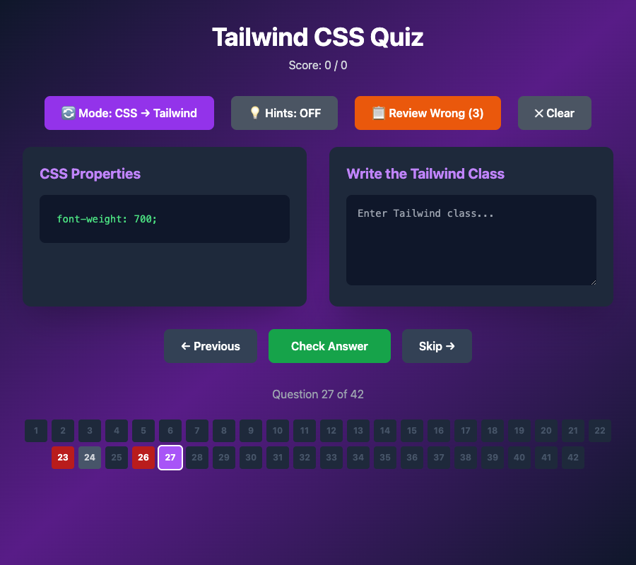
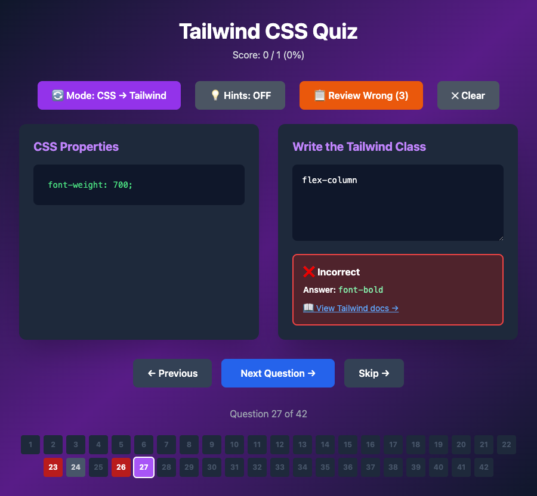

# tailwind-quiz

An interactive quiz app for testing and reinforcing knowledge of Tailwind CSS utility classes. Developers drill on Tailwind concepts — class names, responsive prefixes, and design patterns — with immediate feedback.

**Current progress:** Functional quiz flow is built: flip cards with CSS-to-Tailwind prompts, hints, scoring, auto-advance, a wrong-answer review mode, links to the relevant Tailwind docs page per question, and progress persisted across sessions (via a local dev-only API backed by `wrong-answers.json`).

**Final objective:** A polished, shareable quiz tool covering the Tailwind CSS utility class system, useful for onboarding new developers or sharpening one's own knowledge.

## Screenshots

## Tech Stack

- **Framework:** React 18 with Vite
- **Language:** TypeScript
- **Styling:** TailwindCSS 3
